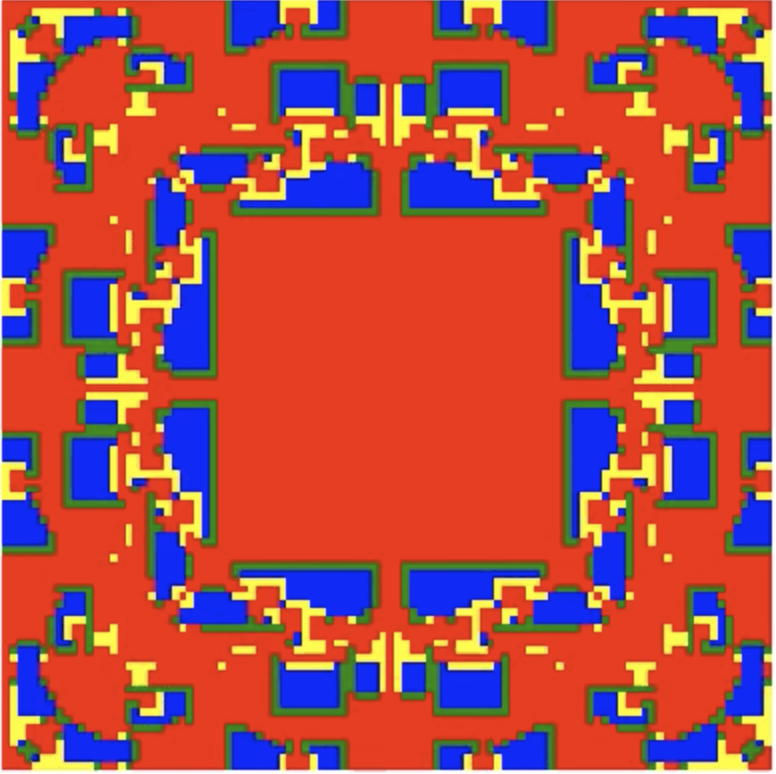
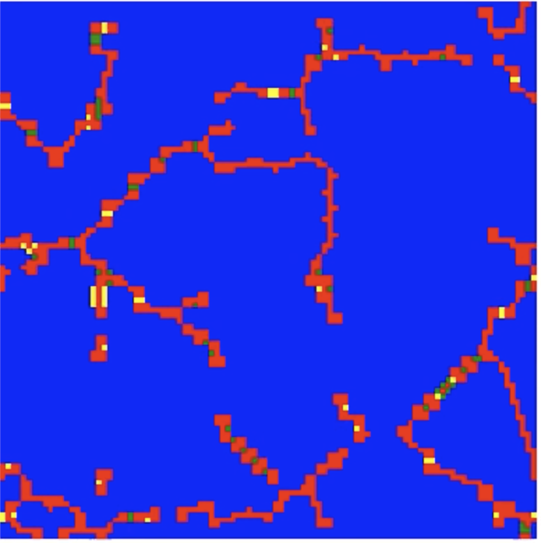
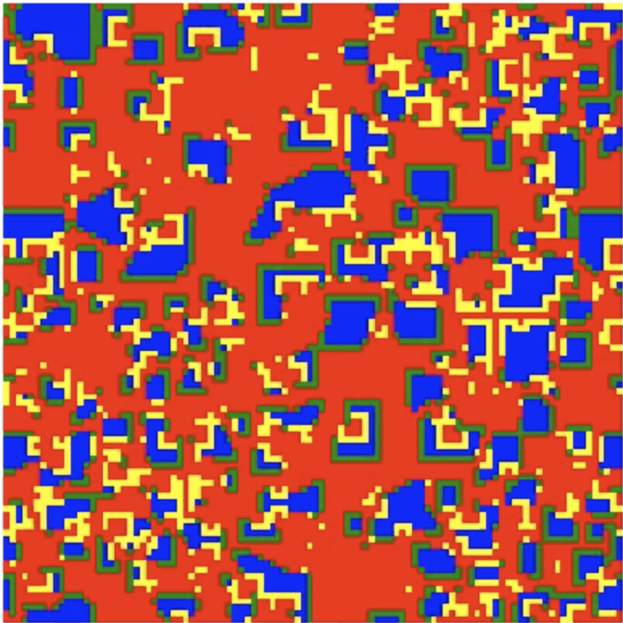

# Cooperation Simulations

This code replicates the algorithm described by Nowak and May (1992) of the spatial Prisoner's dilemma.

# Set up the virtual environment

```bash
make virtualenv
source build/virtualenv/bin/activate
```

Make sure you have ffmpeg installed, you may need to update to the latest version.
```
brew install ffmpeg
```

## Run example

To run the spatial prisoner's dilemma and create a video run:

```
python examples/run_game --game_config_num 0 --grid_len 100 --num_iterations 100
```

There are 3 versions of the game's parameters in this example:
1. `--game_config_num 0` : This will replicate Fig 3 of Nowak and May (1992) - Symmetrical snowflakes
2. `--game_config_num 1` : This will replicate Fig 1a of Nowak and May - Static strings
3. `--game_config_num 2` : This will replicate Fig 1b of Nowak and May - Spatial chaos





# References

Nowak, M.A. and May, R.M., 1992. Evolutionary games and spatial chaos. Nature, 359(6398), pp.826-829.
